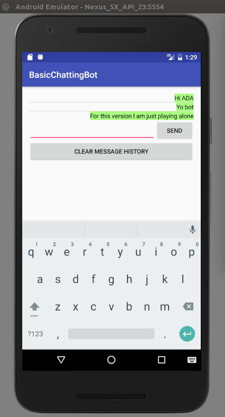
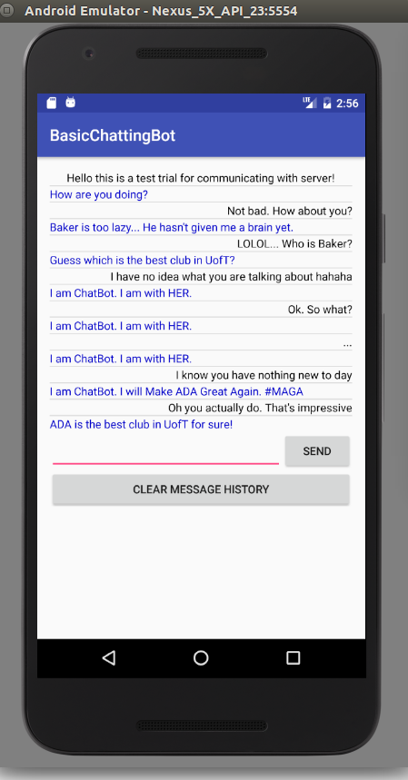

Basic Android Chatting Bot
===

## Target
Write an Android terminal to chat with a server.

## Steps

1. How this app works.  
    - A server is set up on AWS at `http://54.161.23.101`. We can visit it via either curl or browser.  
    Test: Open a console; type in `curl http://54.161.23.101/basicRequest` to see the server's response.  
    - The app sends out a message, and the server responds.  
    - More detailedly, when you click on "send", the app does the following:  
    (1) Updates the message display area.  
    (2) Sends out a request containing the message, and the server responds with a random sentence.   
    (3) After receiving the response, update the message display area again.  
    (4) How to update the message display area? For this tutorial since the pattern is "one ask, one reply" we can just utilize OkHttp's pattern.     
2. Start an Android Studio Project  
    - An Android Studio project contains: AndroidManifest.XML, layout and value XML files, Java Classes, and other material  
    - Different functionalities of the project folders  
    - Activity lifecycle: how the activity components work together and where to put each functionality. Specifically, during start, configuration changes (rotation of screen, etc), and unexpected stops, which methods are called?  
      
3. Basic Contents on Android side  
    1. Set up layout xml file.  
        - Talk about RelativeLayout, LinearLayout, and ListView. ListView shall not be placed within ScrollView  
        - XML attributes  
        - Resources: color, string, dimension, style, drawables. Where to put them, and how to link to them using `@`  
    2. Wire up EditText widget and the Button widget.  
        - addTextChangedListener: save the current text to variable;    
        - onClickListener: Write to file and update ListView.  
    3. Preserve messages in onPause() and recover them in onResume()
    4. Set up ListView and adapter.  
        - XML add ListView   
        - XML add row view  
        - MainActivity setAdapter() in onCreate().  
        - Java define own adapter class, implement its getView() method   
        - Update ListAdapter data every time the data needs to be (using `ListAdapter.notifyDataSetChanged()`). The most important thing is to keep the **same** reference to the Adapter (otherwise data would be lost).  
        - Wrap them up in MainActivity in separate functions to ensure modularity.   
    Up till now you can see the demo:   
    
4. (Optional) Further steps:  
    1. Shoot up a request to server.
        - We ar eusing OkHttp. It is the standard way of internetworking since Android 5.0. Other packages include `HttpURLRequest`, etc. See [this link](https://developer.android.com/training/basics/network-ops/index.html) for more detail.  
        - OkHttp: in `build.gradle` import it to Android project: place OkHttp and Okio in `app/libs/` then File-project structure-dependencies-Add file dependency-select  
        - OkHttpClient and Request. Remember to `runOnUiThread()` when you want to update the UI elements.    
        - Add Internet Permission in `AndroidManifest.xml`  
    Now the functionality is done.  
    
    2. Customizing View.  
    3. What if the network is slow? What if the Activity is unexpectedly closed when the other Thread is running?  
    4. Further steps after the tutorial:
        - If there is no response from Internet, set a timeout mechanism in OkHttp
        - Server side: use more intelligent chatting algorithms.
